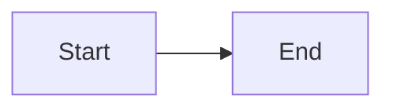

# Content

## Blog (`content/blog/`)

Add a `.md` file with YAML frontmatter:

`````yaml
---
title: "Your post title"
excerpt: "One-line summary for cards and SEO"
author: Quezt Labs
authorRole: Quezt Labs
authorAvatar: /logo.png
date: 2026-05-29
readTime: 6 min read
category: Engineering
tags:
  - vibe coding
  - AI
image: /your-cover.jpg
featured: false
---

Categories we use: `Engineering`, `AI & Tools`, `Culture`, `Design`, `Hot Take`.

**May 2026 topic ideas:** prompts, MCP, agents, RAG, Cursor rules, Gen Z founder slang, micro-SaaS, tool comparisons (`Cursor`, `Claude Code`, `Copilot`), vibe coding, locked in / productivity.
# Your post title

Markdown body here…

### Diagrams (Mermaid)

Use fenced blocks with `mermaid` language:

````markdown


Posts appear on `/blog` automatically. RSS: `/feed.xml`.

## Case studies (`content/case-studies/`)

Link to a live portfolio project with `portfolioId` (matches `lib/vercel-projects.ts`):

```yaml
---
title: Product name
subtitle: Short tagline
description: Card summary
longDescription: Hero paragraph
client: Client name
industry: EdTech
services: [Next.js, Vite]
portfolioId: prep-os
metrics:
  - label: Deploy
    value: Vercel
featured: true
---
```

Story sections go in the markdown body (`## The challenge`, etc.).
````
