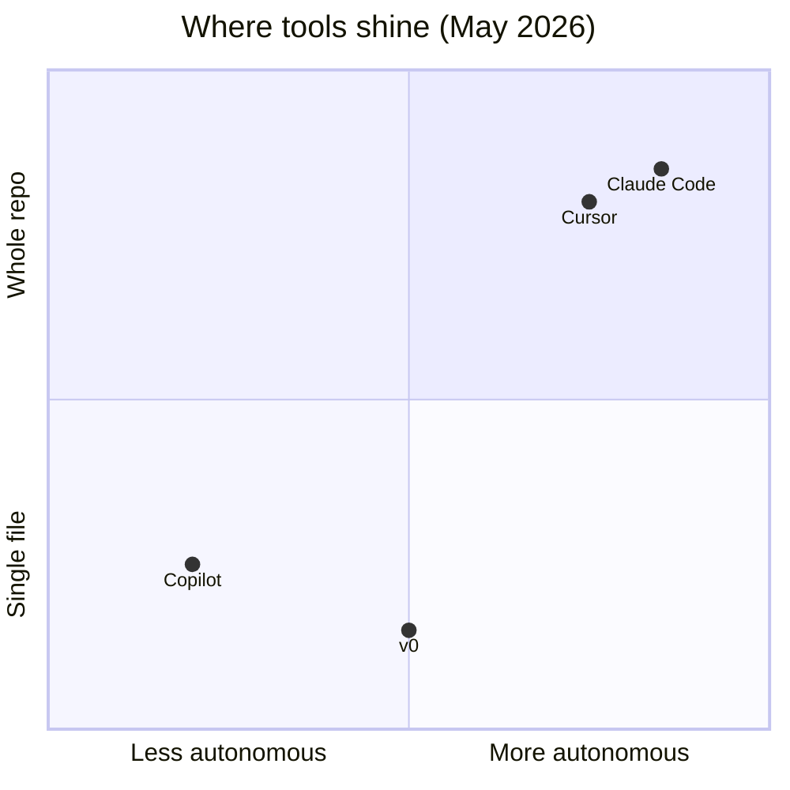

## The 2026 tool wars are real

Search volume is loud for: **Cursor**, **Claude Code**, **GitHub Copilot**, **Windsurf**, **Codeium**, **Bolt**, **v0**.

Nobody needs all of them. You need **one primary** + git + CI.

## Quick matrix

| Tool            | Vibe             | Best at                 | Watch out                  |
| --------------- | ---------------- | ----------------------- | -------------------------- |
| **Cursor**      | IDE-native agent | Multi-file edits, rules | Big diffs                  |
| **Claude Code** | Terminal agent   | Repo-wide tasks         | Subscription / limits      |
| **Copilot**     | Inline ghost     | Speed in known files    | Weak architecture          |
| **Windsurf**    | IDE flows        | Flows, cascades         | Team standardisation       |
| **v0 / Bolt**   | UI gen           | Prototypes              | Not your prod architecture |

## Cursor keywords that matter

- `.cursor/rules` — project law for the model
- `@codebase` — semantic search in repo
- **Composer / Agent mode** — multi-file (name changes; check docs)
- **Tab** — inline completion

**Pro tip:** rules file > 50 random prompts in chat history.

## Claude Code / terminal agents

Trend: **agent in terminal** next to Neovim/Zed/VS Code.

Wins on:

- "Find every `fetch` without error handling"
- Scripted refactors with checkpoints

Loses when:

- You need tight UI preview loop in same window

## Copilot in 2026

Still the king of **typing less in a file you already understand**.

Not the king of **greenfield app architecture**.

Pair it with: strict review on auth/payments.

## What we recommend by team size

| Team         | Stack                                              |
| ------------ | -------------------------------------------------- |
| Solo founder | Cursor or Claude Code + Vercel                     |
| 2–5 devs     | Same + shared `.cursor/rules` in git               |
| Agency       | Standardise one tool; bill for judgment not tokens |

## Gen Z hiring signal

If a junior's resume says **"AI-native developer"** — ask:

1. Show a PR you understood, not just accepted
2. How do you verify package names?
3. What do you refuse to let AI touch?

## TL;DR

Pick one agent IDE, one inline helper optional, keep CI as source of truth. Tools change monthly; **diff discipline** doesn't.
