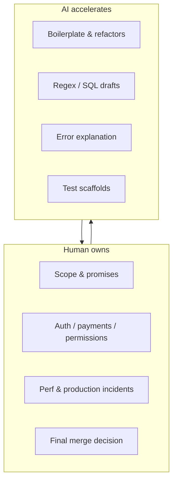
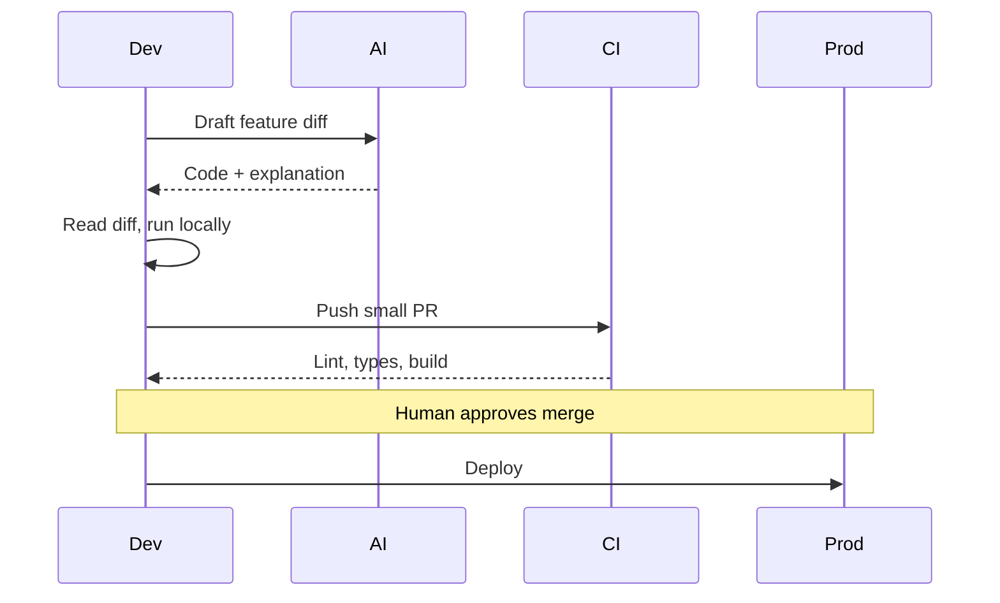
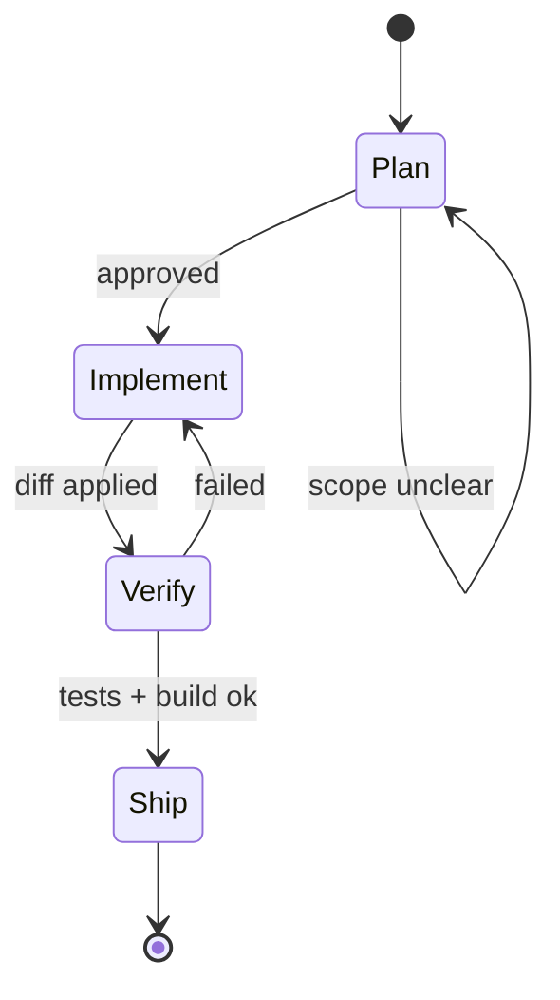

## The question we get every week

_"Bro, poora app AI se bana dete ho?"_

**Short answer:** nahi.  
**Long answer:** AI is in our editor all day — but judgment, architecture, and accountability stay human.

Think of it as a **very fast intern**: great at drafts, dangerous when unsupervised on production keys.

## How AI fits in our stack (not replacing it)



## Daily use matrix

| Task            | AI role            | Human role            |
| --------------- | ------------------ | --------------------- |
| Regex / parsing | Draft + explain    | Verify edge cases     |
| Drizzle / SQL   | Draft query        | Check indexes & N+1   |
| UI layout       | First pass         | Design tokens & a11y  |
| Error messages  | Decode stack trace | Reproduce locally     |
| Tests           | Scaffold cases     | Assert real behaviour |
| Commit messages | Polish             | Own the actual change |

## What we refuse to outsource

- **Who can access what** (RLS, roles, tenant boundaries)
- **Money movement** (checkout, webhooks, refunds)
- **Timeline promises to clients**
- **"Why is prod slow?"** — AI guesses; profiling answers
- **Deleting user data** — one wrong `DELETE` is a headline



## Prompt template that actually works

**Weak prompt:**

> make login work

**Strong prompt:**

```text
Context:
- Next.js 15 App Router, TypeScript strict
- Drizzle + Postgres (Neon), existing users table
- No new npm packages without asking

Task:
- Magic link login, httpOnly session cookie
- Server Action for send-link + verify

Output:
- List files you will change first
- Then show patches only (no full file dumps unless new file)
- Call out security risks in bullets
```

The **constraints** are the difference between help and chaos.

## The four-step loop we repeat

1. **Plan in bullets** — no code until the plan looks sane
2. **Implement smallest slice** — one file group at a time
3. **Run + break it** — happy path and one sad path
4. **Document the surprise** — team note if AI suggested something wrong twice



## When AI makes you slower

- Accepting 400-line diffs you never scroll
- Arguing with wrong abstractions for an hour instead of reverting
- Letting it add dependencies you do not recognise
- Skipping official docs because the chat "sounded confident"

**Rule:** if you have not run the code, you have not shipped — you have only pasted.

## Tooling we actually use (2026)

| Tool                | Use case                               |
| ------------------- | -------------------------------------- |
| Cursor / IDE agents | In-repo edits, multi-file refactors    |
| Chat (GPT-class)    | Architecture spikes, explaining errors |
| CI                  | Truth — build must pass                |
| Staging             | Click the flow with realistic data     |

We do not care which brand wins the hype cycle. We care what survives `pnpm build` and a client demo.

## For juniors: learn, do not skip

Use AI to **explain** a concept after you tried for 20 minutes.  
Do not use it to **skip** understanding hooks, SQL, or HTTP.

The developers who win long-term still know _why_ the fix worked.

## For founders hiring us

You are not paying for tokens. You are paying for:

- Knowing which 20% to vibe
- Knowing which 20% to never touch without review
- Shipping a URL that works when investors click it

## TL;DR

**Copilot, not autopilot.** AI in the editor; brain on the critical path.

---

**Related:** [Vibe coding guardrails](/blog/vibe-coding-without-losing-the-plot) · [When the AI confidently lies](/blog/when-the-ai-confidently-lies)
