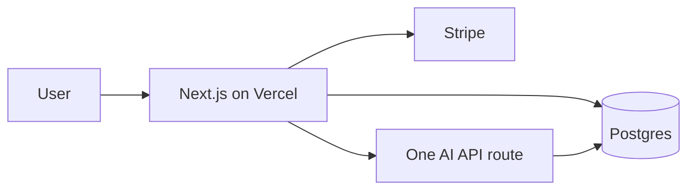

## Side quests that pay rent

2026 trend: developers running **micro-SaaS**, **Notion templates**, **AI wrappers with actual utility**.

Search terms blowing up: `AI side project`, `indie hacker 2026`, `micro saas ideas`, `build in public`.

Most fail from **too many features**, not bad AI.

## The boring stack that wins



| Layer     | Pick                   | Why               |
| --------- | ---------------------- | ----------------- |
| App       | Next.js 15             | SEO + API routes  |
| DB        | Postgres + Drizzle     | You will need SQL |
| Auth      | Clerk / magic link     | Don't roll crypto |
| Pay       | Stripe / Razorpay      | Region-aware      |
| AI        | OpenAI / Anthropic API | One endpoint      |
| Analytics | PostHog / Vercel       | Funnel truth      |

## One AI feature rule

Your product needs **one** AI moment that saves 10+ minutes:

- Summarise uploads
- Generate drafts from form
- Classify support tickets

Not: "AI-powered" in the hero with a chatbot nobody opens.

## Prompt API pattern (server-only)

```text
POST /api/generate
- Validate user session
- Rate limit per plan
- Server calls model with system prompt from env
- Store usage in DB for billing
- Never expose API key client-side
```

Keywords: `AI wrapper`, `token usage`, `rate limiting`, `prompt injection guard`.

## Build in public (2026 edition)

| Platform       | What works                   |
| -------------- | ---------------------------- |
| LinkedIn       | Weekly ship log + screenshot |
| X / Twitter    | Short demos, threads         |
| YouTube Shorts | 30s feature clips            |

**Don't:** post roadmap porn with zero URL.

## Monetisation keywords

- `freemium` — free tier with cap
- `usage-based` — AI credits
- `lifetime deal` — careful, support load

Start **paid early** if B2B; B2C can freemium.

## 14-day side project schedule

| Day   | Output                       |
| ----- | ---------------------------- |
| 1–2   | Problem + landing + waitlist |
| 3–7   | Core loop + auth             |
| 8–10  | AI feature + limits          |
| 11–12 | Stripe + emails              |
| 13–14 | Polish + launch post         |

## TL;DR

Stack boring, positioning spicy, scope tiny. AI is a feature — not the whole company.
