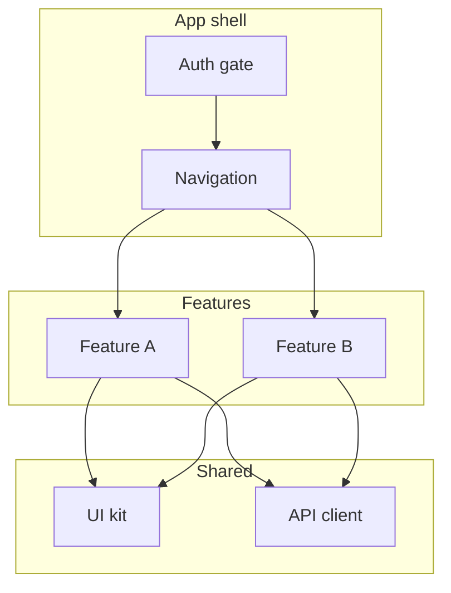

## Architecture that survives year two

Feature folders beat type folders once the app grows:

```
src/
  features/
    auth/
    home/
    settings/
  shared/
    components/
    hooks/
    api/
  navigation/
```



## State: don't default to Redux

| Need            | Tool               |
| --------------- | ------------------ |
| Server data     | TanStack Query     |
| Light global UI | Zustand or Context |
| Form state      | React Hook Form    |

Three state libraries in one app is a smell, not a flex.

## Performance checklist

- `FlatList` for long lists — never `ScrollView` for 200 items
- Image caching strategy day one
- Hermes on Android where possible
- Profile with Flipper / built-in tools before guessing

## Testing pyramid

```mermaid
pyramid
  E2E critical flows
  Integration feature modules
  Unit business logic
```

1. Unit — pure functions, validators
2. Integration — screen + mocked API
3. E2E — signup, pay, core action only

## Offline & releases

- Define what works offline (read-only vs queue writes)
- OTA updates policy with Expo if applicable
- Store review buffer in timeline

## TL;DR

Consistent structure + boring state choices + list performance = apps you can hand to another team.
