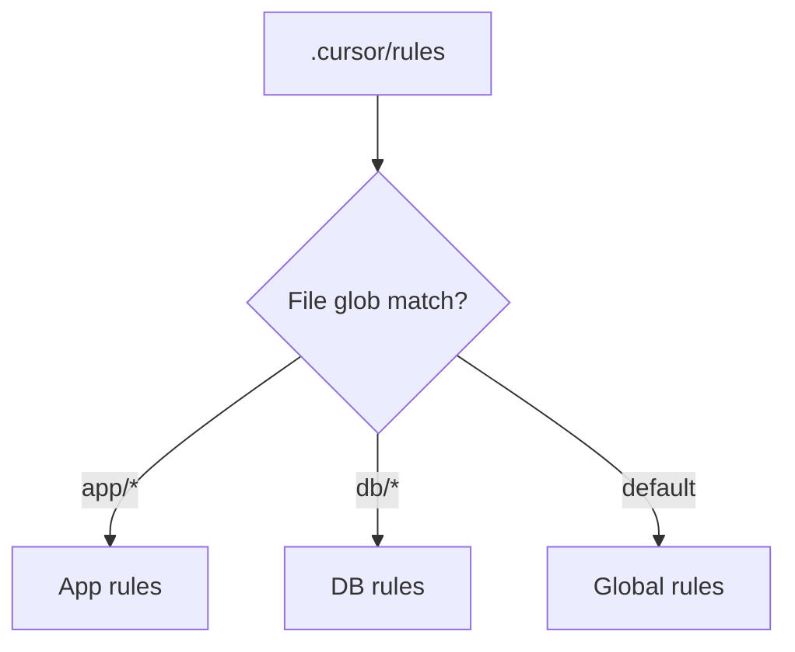

## Rules > random chats

If you're still typing _we use Next.js and Drizzle_ every morning — you're the product.

**`.cursor/rules`** (and team variants) = persistent instructions the agent reads **before** it touches your repo.

Trending: `cursor rules examples`, `cursor project rules 2026`, `AI coding standards`.

## What to put in rules

```markdown
# Stack

- Next.js 15 App Router, TypeScript strict
- Drizzle ORM, Postgres on Neon
- Tailwind + shadcn/ui

# Never

- Add dependencies without asking
- Invent environment variables
- Use Pages Router patterns

# Always

- Prefer Server Actions for mutations
- Use existing `lib/` helpers
- Run types mentally before suggesting code

# Style

- Match existing file naming
- Small PRs, explain risks in bullets
```

## Rules vs docs

| `.cursor/rules`      | `docs/` or README    |
| -------------------- | -------------------- |
| How AI should behave | How humans onboard   |
| Short, imperative    | Long, narrative      |
| Changes with stack   | Changes with product |

## Glob patterns (when supported)

Scope rules to folders:

- `app/**` — RSC patterns
- `db/**` — migration discipline
- `components/ui/**` — design system only

Stops the model from "fixing" marketing copy with backend patterns.



## Team workflow

1. Commit rules to git
2. PR review rules like code
3. Onboard: "read rules before Agent mode"

Agencies: **one rules repo template** per stack (Next MVP, RN app, etc.).

## Common failures

- Rules too long → model ignores tail (**keep < 200 lines**)
- Contradictory rules → chaotic diffs
- No "never touch" list → auth refactors from hell

## TL;DR

Rules are **system prompt as code**. Set once, vibe forever (mostly).

---

[Prompt playbook](/blog/prompt-engineering-playbook-may-2026) · [Tool comparison](/blog/ai-coding-tools-compared-may-2026)
