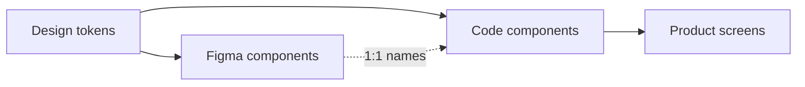

## A system only matters if people use it

Unused Figma libraries are expensive wallpaper. A good system **reduces decisions** and **matches code**.

## Start small (week 1 kit)

| Include                  | Defer                  |
| ------------------------ | ---------------------- |
| Type scale               | 40 icons               |
| Colors + semantic tokens | Complex data viz       |
| Button, Input, Card      | Every marketing layout |
| Spacing rules            | Dark mode tokens day 1 |

## Documentation that ships

Each component doc:

- When to use / not use
- Code example (copy-paste)
- Accessibility notes (focus, labels)
- Do / Don't screenshots

## Adoption tactics

- Match Figma layer names to code props
- CLI or snippet for common patterns
- PR checklist: "uses design system button?"
- Office hours first month — answer "which component?"

## Anti-patterns

- System team blocked from product work for 6 months
- Tokens nobody maps to Tailwind/CSS variables
- Breaking changes without codemods

## TL;DR

Ship the primitives that appear on 80% of screens. Grow with real product pressure, not theory.
