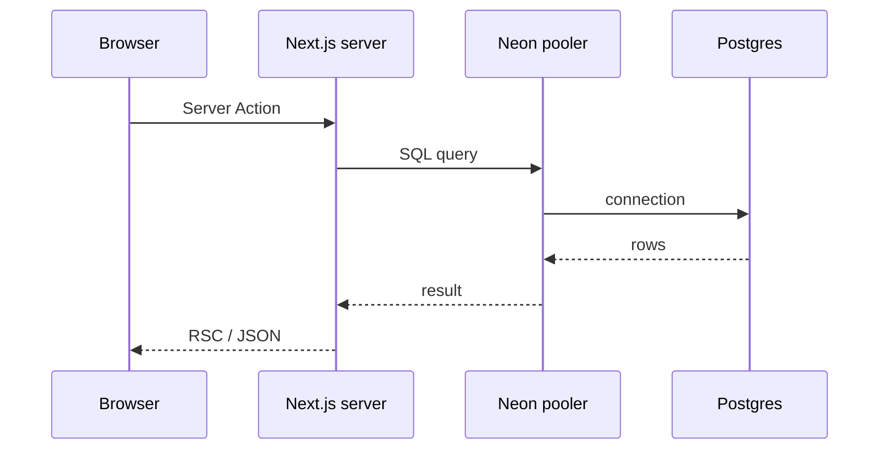
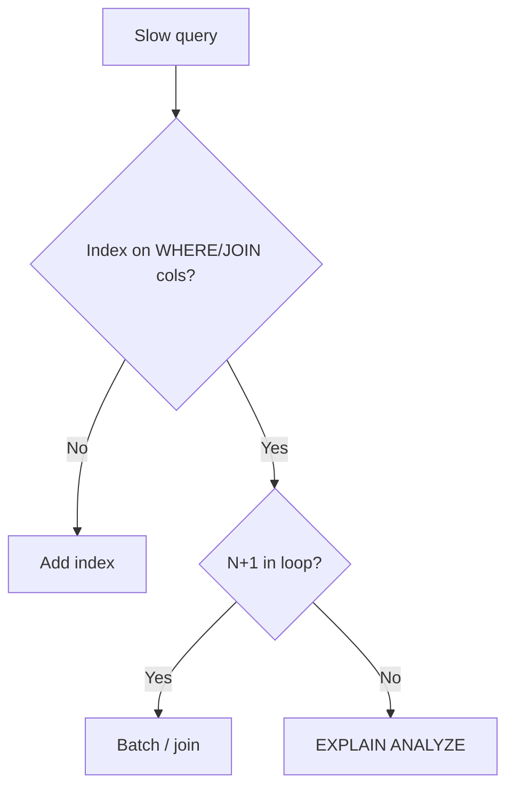

## Why Drizzle on MVPs

Stay close to SQL. TypeScript inference is good enough. Migrations are reviewable. Teams can hire for Postgres, not ORM dialect.

## Folder layout

```
db/
  schema/
    users.ts
    orders.ts
    index.ts      # barrel export
  migrations/
  client.ts       # single db instance pattern
```

```ts
// schema/users.ts
export const users = pgTable("users", {
  id: uuid("id").defaultRandom().primaryKey(),
  email: text("email").notNull().unique(),
  createdAt: timestamp("created_at", { withTimezone: true })
    .defaultNow()
    .notNull(),
});
```

## Request path on Vercel



## Migrations in CI

1. `drizzle-kit generate` in PR — human reads SQL
2. Apply to **staging** DB in CI
3. Prod apply in deploy step or manual gate
4. Never edit applied migration files

## Serverless connection rules

| Environment       | Pattern                                             |
| ----------------- | --------------------------------------------------- |
| Vercel serverless | Neon serverless driver / pool size 1 per invocation |
| Long worker       | Dedicated pool or PgBouncer                         |
| Local dev         | Direct connection OK                                |

## Pitfalls we hit

1. **N+1 in RSC** — batch with `inArray` or joins
2. **Missing FK indexes** — filter columns need indexes
3. **`timestamp` without TZ** — use `timestamptz`
4. **Transactions in Server Actions** — know your isolation level



## TL;DR

Drizzle rewards migration discipline early. Cheap at week 2, priceless at month 6.
