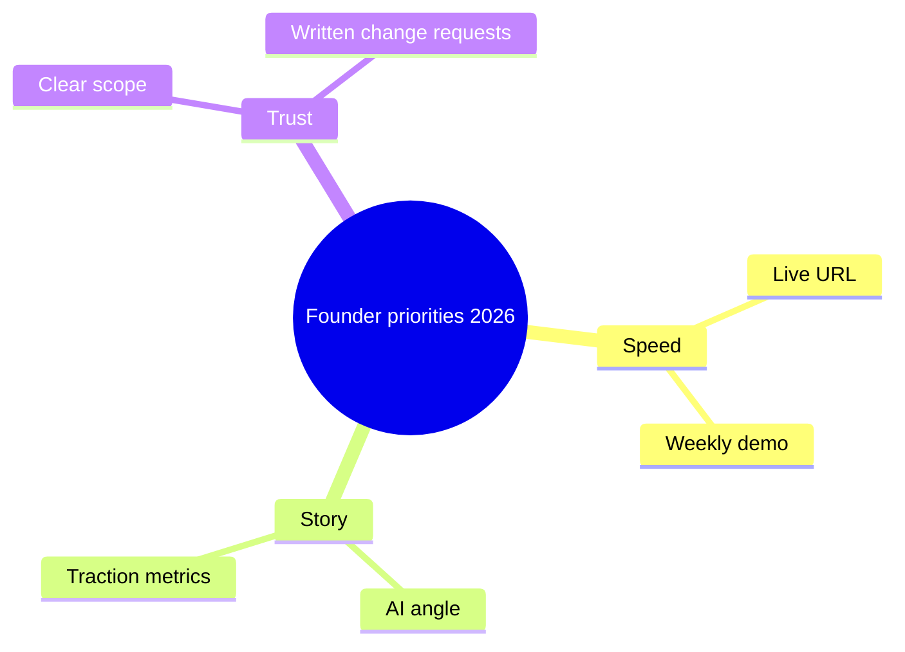

## Why this post exists

DMs in 2026 hit different:

> "We're building the Uber of X, AI-native, need it **locked in** by month-end, budget is **lowkey** tight."

Your job: translate hype into **scope**, **stack**, and **ship criteria** — without being cringe in the reply.

## Keyword glossary (founder → engineering)

| They say                | They often mean     | You deliver                     |
| ----------------------- | ------------------- | ------------------------------- |
| **Locked in**           | Urgent focus        | Fixed scope + date              |
| **AI-native**           | AI somewhere useful | Copilot + one real AI feature   |
| **Vibe / vibe code**    | Fast iteration      | Weekly demos, small PRs         |
| **MVP**                 | Smallest proof      | One loop live on URL            |
| **Scale later**         | No users yet        | Clean schema, boring stack      |
| **Virality**            | Growth              | Share meta, referrals — phase 2 |
| **Delulu** (self-aware) | Big vision          | Roadmap slide, tiny v1          |
| **Side quest**          | Scope creep         | Backlog, not sprint             |
| **It's giving [app]**   | Clone UI vibes      | Pick 3 screens max              |
| **No cap**              | Emphasis            | Get requirements in writing     |

## What Gen Z / Gen Alpha founders care about (data from calls)

1. **Speed to link** — not speed to perfection
2. **Looks legit on mobile** — screenshots for investors
3. **AI story** — for pitch deck, not always product core
4. **Transparent pricing** — hate surprise agency bills
5. **Build in public** optional — LinkedIn > Twitter for many in India

## Red flags in discovery calls

- "ChatGPT already built 80%" (paste repo — bet it's 20%)
- No single user journey defined
- Auth + payments + admin + mobile **week one**
- "We'll go viral on launch" with zero waitlist

## Green flags

- They picked **one** wedge
- They accept ugly v1
- They name competitors calmly
- They ask about **maintenance cost**

## How Quezt Labs replies (template energy)

> Love the vision. For May we'll ship: signup → [core action] → email notify. AI feature in v1.1 unless it's the core loop. Here's the cut list.

Professional. Clear. Not mean.

## SEO / trend terms founders Google

`MVP development 2026`, `hire dev agency India`, `build app with AI`, `startup technical cofounder`, `Next.js MVP cost`.

If you're a founder reading this: **keywords don't ship products. Loops do.**

## TL;DR

Learn the slang to build trust — then translate to scope. Your superpower is saying no with a plan.

---

[Ship ugly guide](/blog/ship-ugly-then-make-it-pretty) · [30-day checklist](/blog/shipping-nextjs-mvp-30-days)
