## Locked in ≠ burned out

**Locked in** = deep focus block.  
**Cooked** = deadline impossible.

You can be both. The fix isn't more AI — it's **structure**.

## The 2026 focus block (90 min)

| Min   | Activity                                     |
| ----- | -------------------------------------------- |
| 0–5   | Write ONE task in issues/Notion              |
| 5–70  | Build — Agent for boilerplate, you for logic |
| 70–80 | Run app + fix red paths                      |
| 80–90 | Commit + note blockers                       |

Phone in another room. Slack status: heads down.

```mermaid
gantt
    title Sample dev day (agency / product)
    dateFormat HH:mm
    section AM
    Deep build block     :09:00, 90m
    Standup / comms      :10:30, 30m
    Deep build block     :11:00, 90m
    section PM
    Reviews + PRs        :14:00, 60m
    Lighter tasks        :15:00, 90m
```

## AI in the routine (not replacing it)

- **Morning:** Agent generates scaffold — you review before coffee #2
- **Afternoon:** You write critical path — AI explains errors
- **Never:** Merge before standup if you can't explain diff

## Anti-burnout keywords (real talk)

Trend: `dev burnout 2026`, `quiet quitting`, `touch grass`.  
For builders: **ship sustainable** beats **ship viral once**.

- Hard stop time
- One day low-meeting
- Walk between blocks — yes, seriously

## Tools that help focus

| Tool                   | Use                       |
| ---------------------- | ------------------------- |
| Cursor / IDE           | Flow                      |
| Linear / GitHub issues | One task visible          |
| Pomodoro (optional)    | If ADHD brain needs ticks |
| Opal / Screen Time     | Block reels               |

## TL;DR

Locked in = protect 90 minutes, one task, review AI output, commit. Repeat. That's the trend worth following.
