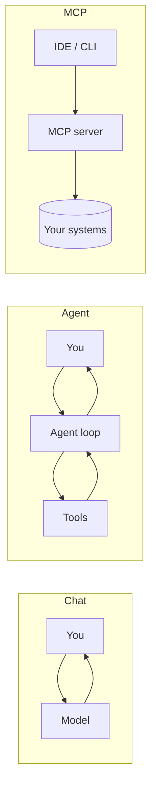
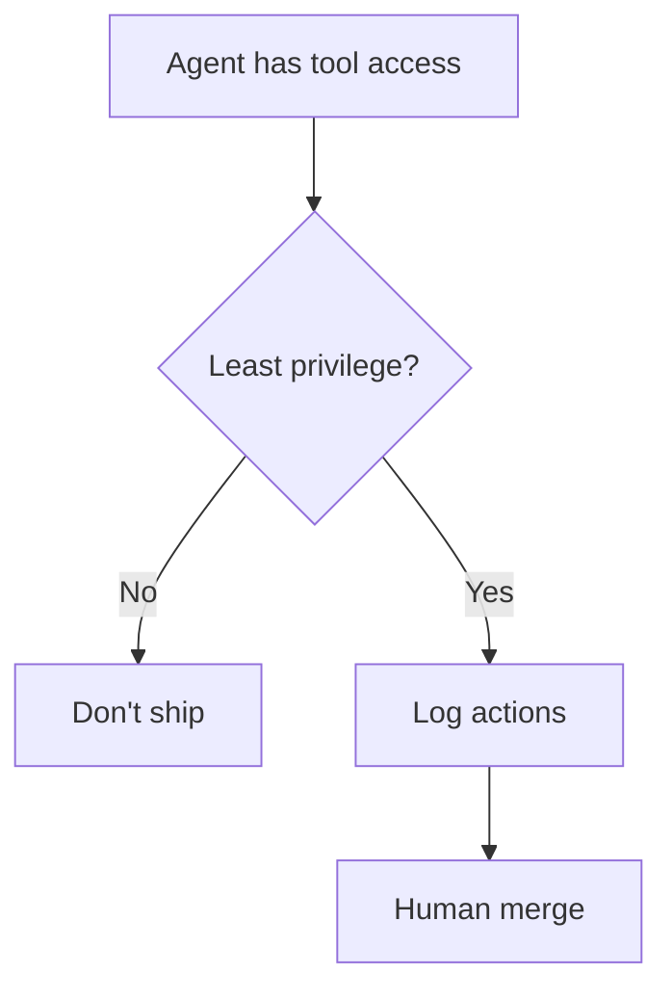

## Why your timeline is full of "MCP"

**MCP (Model Context Protocol)** = a standard way for AI tools to talk to **your** data sources — repos, DBs, Linear, Figma, browsers — without copy-pasting everything into chat.

Think **USB-C for AI integrations**: one port, many devices.

Trending alongside: `AI agents`, `agentic coding`, `tool use`, `context window`, `RAG`.

## Chat vs agent vs MCP

| Pattern | Best for                                   |
| ------- | ------------------------------------------ |
| Chat    | Explain, draft, small edits                |
| Agent   | Multi-step research, refactors with checks |
| MCP     | Persistent access to live context          |

## What we'd actually wire in 2026

| MCP source         | Dev value                     |
| ------------------ | ----------------------------- |
| GitHub / git       | PR context, blame, issues     |
| Postgres read-only | Schema-aware SQL drafts       |
| Figma              | Design-to-code hints          |
| Browser            | E2E repro, scrape public docs |

**Skip for now:** 12 MCP servers you never open. Start with **one** that saves 30 min/day.

## RAG in one paragraph

**RAG** = retrieve relevant docs/snippets, _then_ ask the model.  
Your blog, your API spec, your `README` — not the whole internet.

Keywords: `embeddings`, `vector DB`, `chunking`.  
For MVPs: often **good markdown in repo** beats a fancy vector stack.

## Agents: the hype vs the job

An **agent** loops: plan → tool call → observe → repeat.

Good for:

- Generating migration drafts + you review SQL
- Fixing lint across repo with tests
- Research: "list all env vars used"

Bad for:

- Unsupervised prod deploys
- "Fix security" with no threat model

## Security keywords you must know

- **Prompt injection** — untrusted text steers the model
- **Over-scoped tools** — agent can delete more than you meant
- **Secrets in context** — never paste prod keys into chat

## TL;DR

MCP = plug your stack into AI tools. Agents = loops with tools. Start small, read diffs, stay allergic to auto-merge.

---

**Related:** [Prompt playbook](/blog/prompt-engineering-playbook-may-2026)
