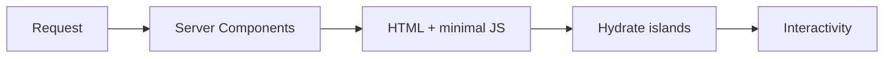
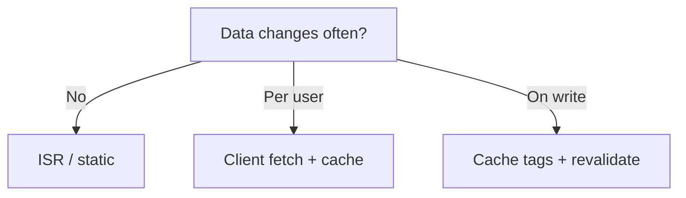

## Baseline truth

Next.js is already fast. "Great" means fewer bytes, less JS on first paint, and data fetched in the right **layer** (server vs client).



## Images

Always `next/image`:

- Lazy load below fold
- Correct `sizes`
- WebP/AVIF via config
- Blur placeholder for LCP hero

## Code splitting

```ts
const HeavyChart = dynamic(() => import("./Chart"), {
  loading: () => <Skeleton />,
  ssr: false, // only if browser-only
});
```

| Pattern           | When                    |
| ----------------- | ----------------------- |
| Route-level split | Automatic in App Router |
| `dynamic()`       | Heavy client widgets    |
| Lazy below fold   | Marketing sections      |

## Caching mental model

| Pattern            | Use                              |
| ------------------ | -------------------------------- |
| Static / ISR       | Marketing, rarely changing pages |
| `revalidate`       | Blog, catalog with TTL           |
| `fetch` cache tags | Invalidate on CMS publish        |
| Client SWR         | User-specific dashboard widgets  |



## Measure, don't vibe

1. Lighthouse CI on PR (marketing routes)
2. Vercel Analytics / Web Vitals
3. React DevTools profiler for jank

## TL;DR

Server-first, split heavy client, measure LCP and TTI — repeat.
