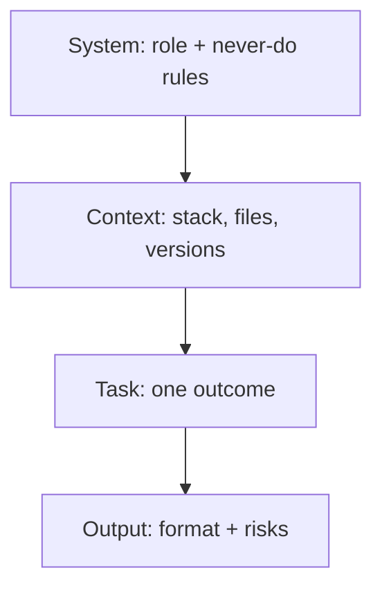

## Prompt engineering is not astrology

In 2026 everyone says they "do AI." What they mean is they type _make app_ and pray.

**Prompt engineering** = giving the model **context, constraints, and a definition of done** so output is reviewable — not magic.

Trending search terms right now: `prompt templates`, `system prompt`, `Claude 4`, `Cursor rules`, `agentic workflow`. This post is the stack-agnostic version we use daily.

## The 4-layer prompt stack



| Layer   | Example                                                    |
| ------- | ---------------------------------------------------------- |
| System  | "You are a senior Next.js dev. Never invent npm packages." |
| Context | "App Router, Drizzle, this `schema.ts`"                    |
| Task    | "Add magic-link login"                                     |
| Output  | "List files changed + security risks"                      |

## Copy-paste: feature slice

```text
ROLE: Senior full-stack engineer. Skeptical of hype.

STACK (pinned):
- Next.js 15 App Router, TypeScript strict
- Drizzle + Postgres (Neon)
- No new dependencies without approval

TASK:
Implement [ONE FEATURE]. Smallest diff possible.

OUTPUT:
1. Plan (max 6 bullets)
2. Files to touch
3. Code patches only
4. "What I might have wrong" section
```

## Copy-paste: debug mode

```text
I will paste: error, stack trace, and 15 lines above the throw.

Do NOT rewrite the whole file.
1. Root cause in plain English
2. Minimal fix
3. How to verify locally
4. One test idea

If unsure, say "I need file X" — do not guess APIs.
```

## Gen Z / founder speak → what devs need

Founders say **"locked in"** — you need **acceptance criteria**.  
They say **"AI will handle it"** — you need **who owns auth and payments**.  
They say **"just vibe it"** — you need **a revert plan**.

| They say            | You translate                 |
| ------------------- | ----------------------------- |
| "Ship by Friday"    | One loop, cut scope doc       |
| "Make it viral"     | SEO + OG + share card, week 2 |
| "Like Notion but X" | Pick 3 Notion features max    |

## Few-shot still hits in 2026

For repetitive UI (tables, forms, API handlers), paste **one golden example** from your repo:

> Match this file's patterns exactly: naming, error handling, folder layout.

Models pattern-match faster than they invent.

## Anti-patterns (no cap, these hurt)

- **Wall of vague** — 2 pages of vision, zero constraints
- **Mega thread** — 40 messages; start fresh with summary
- **Trust the package name** — always verify on npm
- **Skip the plan** — code before bullets = rework

## Tool-specific keywords (May 2026)

| Tool            | What to pin in prompts                   |
| --------------- | ---------------------------------------- |
| **Cursor**      | `.cursor/rules`, `@codebase`, file globs |
| **Claude Code** | repo map, test command                   |
| **ChatGPT**     | upload schema + API types                |
| **Copilot**     | inline only; weak on architecture        |

## TL;DR

**Context + constraints + small tasks.** Prompt like you're briefing a fast intern who sometimes lies about package names.

---

**Next:** [MCP & agents](/blog/mcp-agents-for-devs-may-2026) · [Cursor vs the field](/blog/ai-coding-tools-compared-may-2026)
