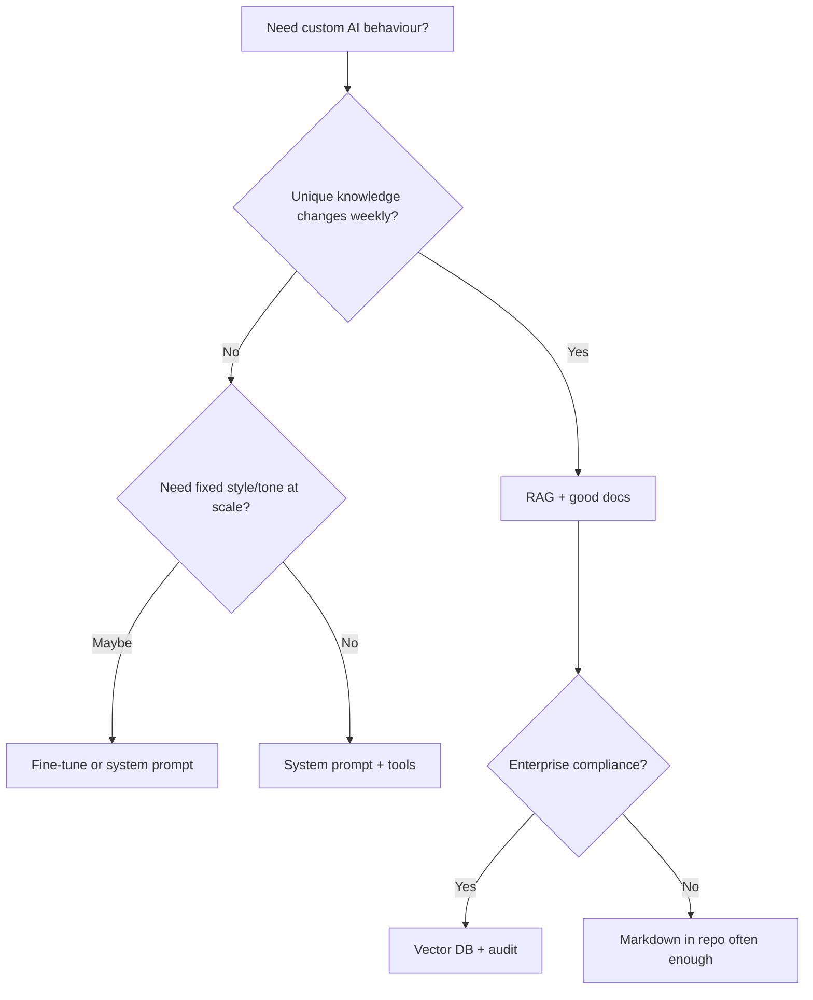

## The sales call trap

"We need to fine-tune GPT on our data."

Often they need: **search + paste relevant chunks + ask question**.

That's **RAG** (retrieval-augmented generation). Cheaper. Faster to ship. Easier to fix when wrong.

## Decision tree

## RAG stack keywords (2026)

| Term              | Meaning                       |
| ----------------- | ----------------------------- |
| **Embeddings**    | Vector representation of text |
| **Chunking**      | Split docs into pieces        |
| **Vector DB**     | Pinecone, pgvector, Weaviate  |
| **Hybrid search** | Keywords + vectors            |
| **Re-ranking**    | Second pass for quality       |

## MVP RAG (no cap, this works)

1. Export help docs / Notion → markdown in `/content/kb`
2. On question: keyword search or simple embedding
3. Top 5 chunks → system prompt
4. Answer + cite sources

Ship in **days**, not months.

## When fine-tuning makes sense

- Consistent output format at huge volume
- Proprietary style where prompt alone fails
- Moderation / classification at scale

Not for: "make it know our 40-page PDF" (that's RAG).

## Cost keywords founders ask

- `embedding cost`
- `token usage`
- `context window`
- `caching prompts`

**Rule:** measure $ per successful user task, not per demo wow.

## Security

- Don't put secrets in chunks
- Filter retrieved content before model sees it
- Log queries for abuse

## TL;DR

2026 default: **RAG + system prompt**. Fine-tune when metrics prove prompt isn't enough.
