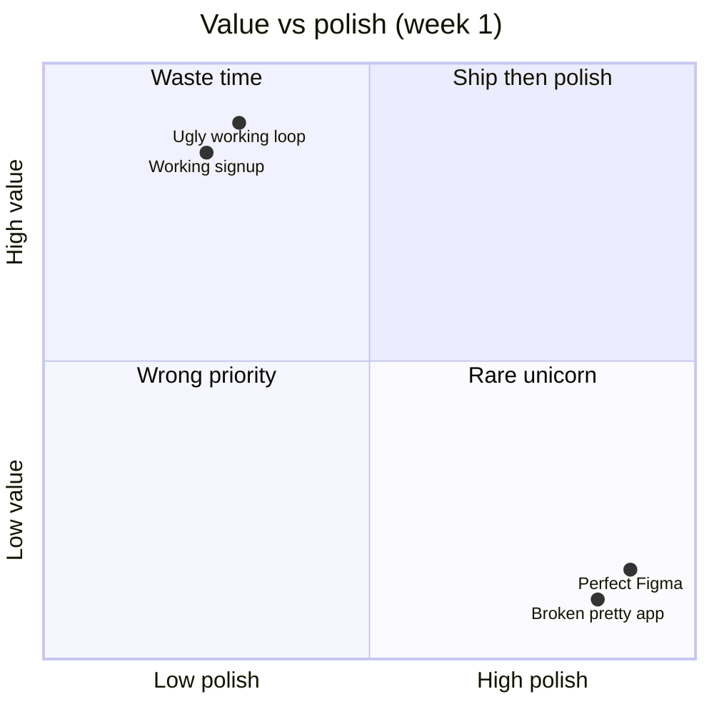
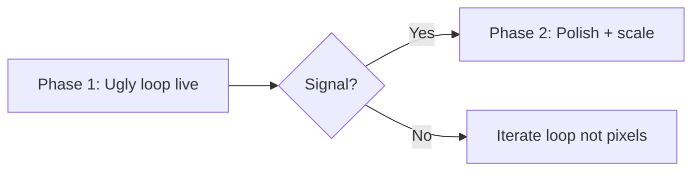

## Six weeks on fonts, zero users

We've seen teams spend a month on:

- Custom easing on a landing page nobody visits
- Dark mode before light mode works
- A design system with **one button variant**

Meanwhile signup 500s and nobody has metrics because there is nothing to measure.

## Ugly + real beats pretty + fake

Users forgive:

- Basic spacing
- Stock icons
- Copy that is clear, not clever

Users do not forgive:

- Cannot complete signup
- Payment succeeded, order missing
- "We'll fix after launch" for quarter two

## Two-phase contract

### Phase 1 — Ugly ship (2–4 weeks)

| Must have                   | Nice to skip         |
| --------------------------- | -------------------- |
| One complete user loop      | Custom illustrations |
| Error messages humans wrote | Page transitions     |
| Logging you can grep        | A/B tests            |
| Deploy URL                  | Brand video          |

### Phase 2 — Pretty ship

Brand, motion, empty states, mobile polish — **after** signal (retention, payments, waitlist conversion).

## For founders

If agency shows only Figma at week 4 — ask for the **working link**.  
If dev says "can't demo yet" at week 8 — ask what works **today**, even if ugly.

## For developers

Your ego is not the milestone. The **URL** is.

## What "ugly" does not mean

- No auth on admin routes
- No HTTPS
- Storing passwords wrong
- Skipping backups on prod DB

Ugly is visual and UX debt — not security debt.

## TL;DR

Ship the loop. Measure. Then make it beautiful with money or data backing the polish.

---

[Book a strategy call](/#contact) if you want Phase 1 done without theatre.
