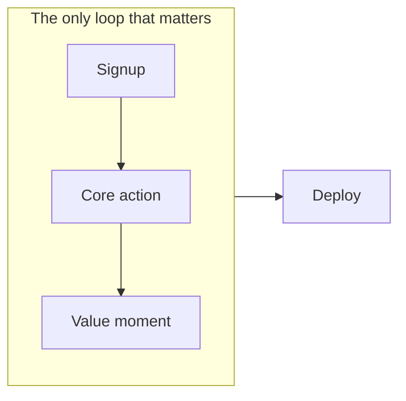
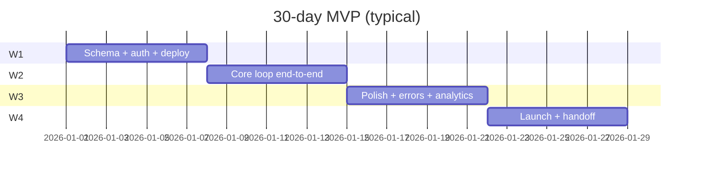

## What this is

A **cut list**, not a feature buffet. We run 30-day sprints for founders; this is the schedule that survives contact with reality when someone asks for "Uber + Notion + AI" in one month.

## Week 0 — Scope or suffer

| In                               | Out (for now)                       |
| -------------------------------- | ----------------------------------- |
| One user loop                    | Second persona                      |
| Email auth or OAuth pick **one** | Social + magic + password same week |
| Postgres                         | Microservices                       |
| Vercel deploy                    | Multi-region                        |

## Week 1 — Skeleton

- Next.js App Router + Tailwind + component kit you already know
- DB schema: **minimum tables** for the loop
- Preview deploy day 3 — forces env discipline early
- `loading.tsx` / error boundary on the loop route only

**Stack default:**

| Layer     | Pick                               |
| --------- | ---------------------------------- |
| Framework | Next.js 15+                        |
| DB        | Postgres + Drizzle or Prisma       |
| Auth      | Clerk **or** magic link — not both |
| Email     | Resend                             |
| Host      | Vercel                             |

## Week 2 — Core loop

- Server Actions or Route Handlers — avoid extra API layer unless mobile client needs it
- Payments only if money is week-1 critical (Stripe/Razorpay)
- Admin? A single protected `/admin` route, not a second app

## Week 3 — Ops & trust

- Error boundaries on user-facing routes
- Basic analytics (Vercel + one product event)
- SEO: metadata, sitemap, OG for marketing page
- Staging vs prod env documented

## Week 4 — Launch

- Lighthouse on marketing + app shell (not obsession, sanity)
- Runbook: env vars, rollback, who gets paged
- Handoff: README, demo script, known limitations list

## Kill list (say no out loud)

- Real-time everything
- Custom design system before users
- Mobile app **and** web unless budget doubles
- "We'll add tests later" on payment code

## TL;DR

MVPs die from scope creep, not missing dark mode. One loop, one deploy, one honest demo.
