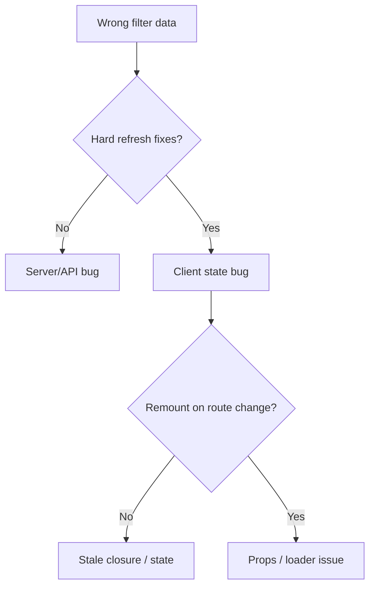
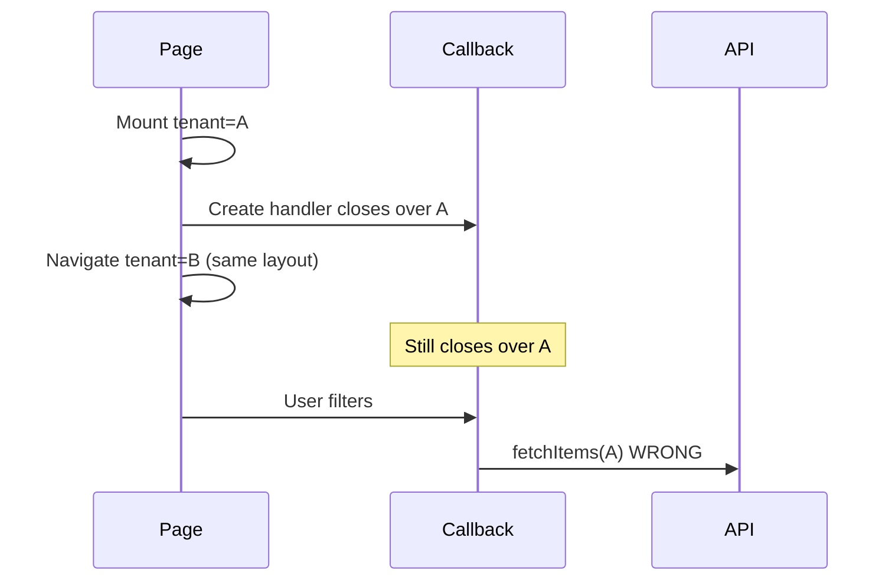

## Symptom

Staging looked fine. Production "sometimes" showed the wrong filter list after client-side navigation. No consistent repro at first — the worst kind.

## What we ruled out (in order)

1. API caching — headers looked correct
2. React 19 "being React" — tempting, insufficient
3. CDN — same bug logged in on VPN off
4. Deploy cache — hard refresh did not fix



## The actual bug

```ts
// Museum exhibit
const onFilter = useCallback(() => {
  fetchItems(tenantId);
}, []);
```

`tenantId` came from route context on first paint. Client navigated to another tenant **without remounting**. Handler still closed over the **first** `tenantId`.

## The fix

```ts
const onFilter = useCallback(() => {
  fetchItems(tenantId);
}, [tenantId]);
```

Seven characters. Two hours. Zero AI required.

## Why ESLint mattered

`react-hooks/exhaustive-deps` was yelling the whole time. We had it disabled on that file from an old "quick fix."

**Lesson:** never silence a rule you do not understand.

## Mental model diagram



## What we did not do

- Rewrite filters in another framework
- Ask AI to "fix filter bug" without context
- Ship a feature flag for "legacy filter mode"

## Checklist for similar bugs

- [ ] Repro with navigation, not only full page load
- [ ] Log `tenantId` inside handler at click time
- [ ] Check `useCallback` / `useMemo` deps
- [ ] Check list `key` props on route params

## TL;DR

Before AI, before rewrites — check closures, keys, and whether the component actually remounted.
