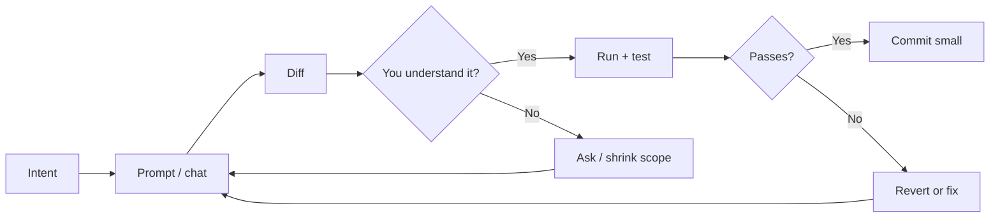
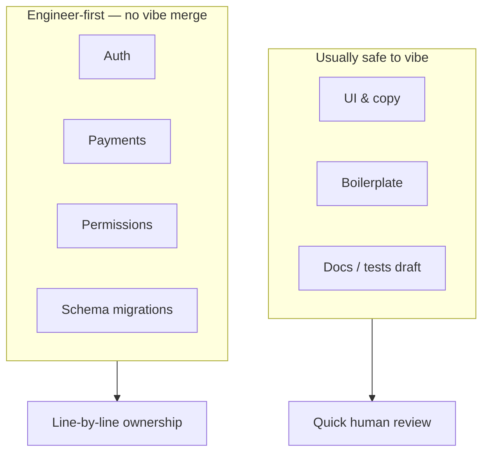
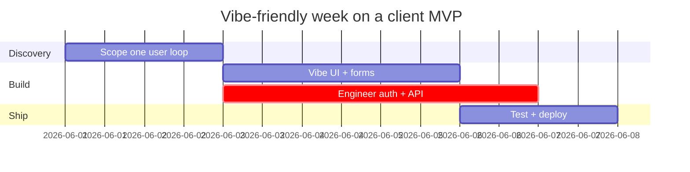

## The scene everyone recognises

Tab one: Figma or a half-finished PRD. Tab two: `localhost:3000`. Tab three: an AI chat that _mostly_ understands what you meant. Lo-fi playlist. Git history that looks like emotional damage.

That is **vibe coding** — building by feel, conversation, and fast iteration instead of typing every character from first principles.

It is not cheating. It is how a huge number of MVPs, internal tools, and weekend experiments actually get finished in 2026. The failure mode is not "using AI." The failure mode is **shipping a system you cannot explain or debug**.

This post is the map we use so the vibe stays fun and production stays boring (in a good way).

## What vibe coding is (and is not)

**It is:** describing outcomes, reviewing diffs, steering, reverting, shipping small slices.

**It is not:** skipping architecture, skipping security review, or treating green AI output as proof something works.

## Where vibe coding prints money

| Zone             | Examples                      | Risk if you vibe blindly        |
| ---------------- | ----------------------------- | ------------------------------- |
| **UI shell**     | Layout, spacing, empty states | Inconsistent tokens             |
| **Boilerplate**  | Forms, tables, CRUD scaffolds | Wrong data model                |
| **Spikes**       | "Try charts with this lib"    | Dependency bloat                |
| **Docs & tests** | README, smoke tests           | Lying tests that always pass    |
| **Refactors**    | Rename, extract component     | Behaviour change hidden in diff |

## The red zone — read every line yourself

These paths affect money, trust, or legal exposure. We do not vibe-merge them:

- Authentication and session handling
- Authorization (who can see/edit what)
- Payments, refunds, webhooks
- Data deletion and exports (GDPR-style asks)
- Migrations that drop or rewrite columns
- Rate limits and abuse prevention

## Our five guardrails (non-negotiable)

### 1. One intent per session

Bad session goal: _"make dashboard good."_  
Good session goal: _"add date range filter to orders table; server-side query only."_

Small intent → small diff → you actually read it.

### 2. The ten-minute explanation test

Before merge, you should explain to another developer (or future-you):

- What files changed and why
- Where state lives now
- What breaks if the API is slow or returns 500

If you cannot do that in ten minutes, the vibe was too wide.

### 3. Types, lint, and build are the adults

Let TypeScript and ESLint ruin the party early. A red squiggle at 4 p.m. beats a PagerDuty at 4 a.m.

### 4. Revert is a feature, not a failure

`git stash` and `git checkout -- .` after a bad hour are professional moves. The sunk cost of a wrong AI diff is smaller than the cost of shipping it.

### 5. Pin reality in the prompt

Always anchor:

- Framework version (e.g. Next.js 15 App Router)
- Existing libraries (no mystery installs)
- Files you are allowed to touch
- What "done" means (acceptance criteria)

## A week in the life (honest version)

Monday–Tuesday: lock **one** user journey.  
Wednesday–Thursday: vibe the UI; engineer the auth path in parallel.  
Friday: run the loop on staging with real data shape, not lorem ipsum.

## Common failure patterns we see

1. **Three state libraries** because each prompt forgot the last choice (Context + Zustand + Redux "just for this screen").
2. **Mystery `useEffect`** that fetches on every render until someone profiles.
3. **"AI added Stripe"** without idempotency keys on webhooks.
4. **Giant PR** titled `wip` that nobody reviews.

## Checklist before you push

- [ ] I ran the app and clicked the changed flow
- [ ] `pnpm build` (or equivalent) passes
- [ ] No new env vars without `.env.example` updated
- [ ] Diff size feels explainable in one Slack message
- [ ] Critical path files were read, not skimmed

## TL;DR

Vibe the paint. Engineer the foundation. If your commit message is `ai fix` and nothing else — open the diff again.

---

**Next read:** [AI in my editor, not in my brain](/blog/ai-in-my-editor-not-in-my-brain) · [When the AI confidently lies](/blog/when-the-ai-confidently-lies)
