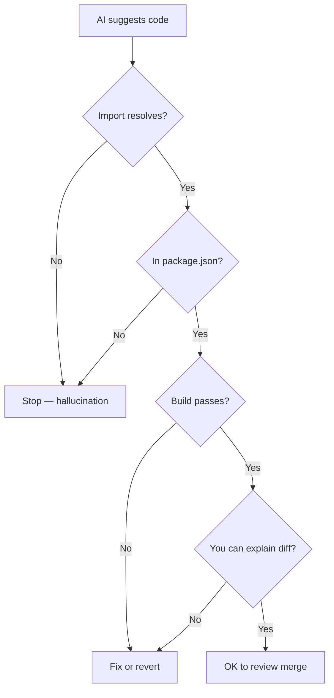
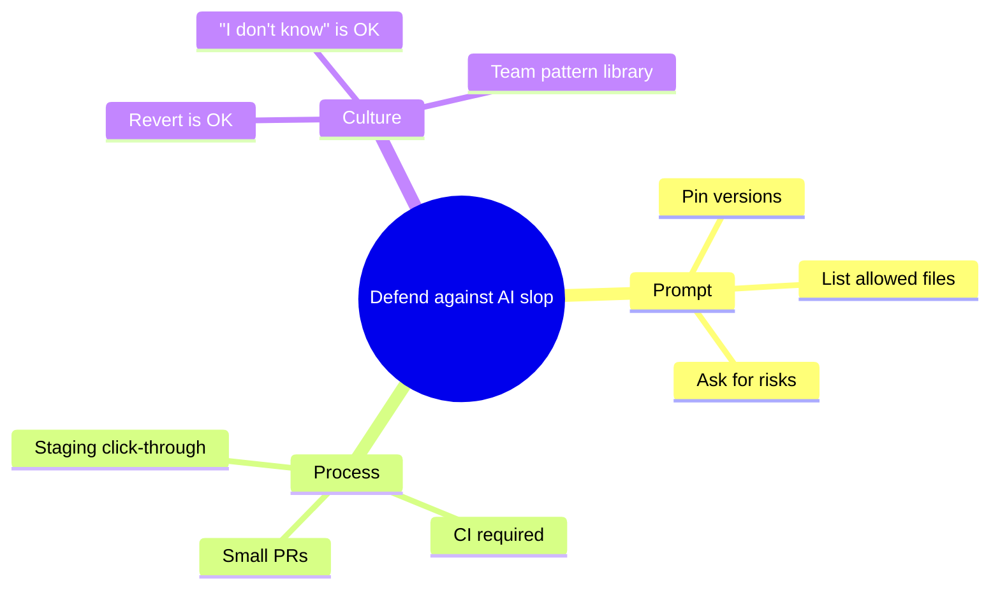

## The most dangerous output is confident wrong code

Wrong code with hesitation? You investigate.  
Wrong code delivered like a staff engineer wrote it? You merge — and meet prod at 2 a.m.

## Hall of fame (things we've seen)

| Fiction                                     | Reality check                                      |
| ------------------------------------------- | -------------------------------------------------- |
| `useServerAction()`                         | Does it exist in _your_ Next version? Cmd+click it |
| `@auth/helpers-v99`                         | Search npm — package real?                         |
| `experimental.magic: true`                  | Read `next.config` docs                            |
| "Just drop the users table"                 | Read the migration SQL                             |
| Env var `STRIPE_WEBHOOK_SECRET` set in chat | Is it in Vercel?                                   |

## The 30-second smell test

Before any AI-generated merge:

1. **Import exists** — IDE navigation, not trust
2. **`package.json` unchanged** or you intended the add
3. **`pnpm build`** on your machine
4. **Would you bet ₹500** it works first try?

Three "no" answers → do not merge.

## Why it lies (without mysticism)

Models predict plausible text. Plausible ≠ true for your repo, your versions, your edge cases. Training data includes outdated blog posts, abandoned APIs, and other people's hallucinations.

## Defence playbook

### Pin the docs

> Use Next.js 15 App Router official docs only. If unsure, say "I need the doc link" — do not invent APIs.

### Team "burn book"

Keep a living doc: patterns that failed twice (`wrong middleware shape`, `fake drizzle helper`, etc.). Feed it into prompts.

### CI is the referee

Lint, types, build, smoke test. AI does not get a pass because it sounded smart.

## Real incident shape (composite)

1. AI adds auth middleware with wrong cookie name
2. Works on happy path locally (cached session)
3. Staging: random logouts
4. Root cause: middleware never ran on matcher — **copy-paste from outdated tutorial**

Fix time: 20 minutes. Ego damage: optional.

## TL;DR

Skepticism is a core skill in 2026. Read the diff. Run the build. Bet small before you bet prod.

---

**Next:** [AI in my editor](/blog/ai-in-my-editor-not-in-my-brain)
